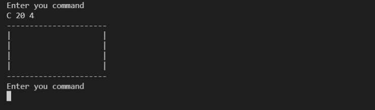

# A simple console drawing application

## Steps to start application
 - Import the code in visual code or any other IDE
 - Import the dependencies (pom.xml)
 - Start the application (F5)

## Features/ Assumptions
 - Canvas has to be created first before we can add any line/rectangle or bucket fill
 - Only horizontal and vertical lines can be created
 - Only lines within the canvas boundary can be drawn
 - Commands are sanitized before implementing (handling of extra spaces at the front and back)
 - Shapes can be drawn only if the initial coordinates lie within the canvas boundary
 - Detailed test cases are written

## Commands

| Commands      |      Description                                                       |
|---------------|:----------------------------------------------------------------------:|
| C w h         |  Should create a new canvas of width w and height h                    |
| L x1 y1 x2 y2 |  Should create a new line from (x1,y1) to (x2,y2). Currently only      |
|               |  horizontal or vertical lines are supported. Horizontal and            |
|               |  vertical lines will be drawn using the 'x' character                  |
| R x1 y1 x2 y2 |  Should create a new rectangle, whose upper left corner is (x1,y1) and |
|               |  lower right corner is (x2,y2). Horizontal and vertical lines will be  | |               |  drawn using the 'x'character                                          | |               |                                                                        |
| B x y c       |  Should fill the entire area connected to (x,y) with "colour" c. The   |
|               |  programs                                                              |
| Q             |  Should quit the program                                               |

## Images

- Initial

- Creating Canvas

 

- Adding line

- Adding another line

- Adding rectangle

- Bucket fill

